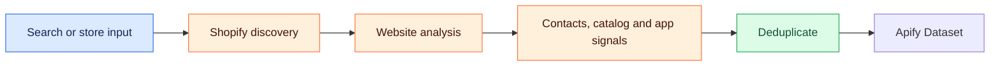

# ⚡ Shopify Store Lead Extractor

[🛍️ Shopify Leads, Public Emails, Social Profiles, Catalog Signals & App Detection](#section-1) · [🎯 The Challenge](#section-2) · [✨ The Solution](#section-3) · [🏆 Key Features](#section-4)

### 🗺️ Visual overview

A visual guide to the project and the documentation below.



---


[](https://apify.com/opility/shopify-store-lead-extractor-emails-catalog-size-apps)
[](https://apify.com/opility/shopify-store-lead-extractor-emails-catalog-size-apps)
[](https://python.org/)
[](https://apify.com/opility/shopify-store-lead-extractor-emails-catalog-size-apps/api/mcp)

<a id="section-1"></a>

## 🛍️ Shopify Leads, Public Emails, Social Profiles, Catalog Signals & App Detection

A Python-based Apify Actor for discovering Shopify stores and extracting useful publicly available ecommerce intelligence.

The Actor can collect:

- 📧 Public business email addresses
- 📱 Social profile links
- 📦 Shopify catalog-size signals
- 🧩 Detected ecommerce apps
- 🌐 Store/domain information
- 📊 Structured Apify Dataset output

Built for ecommerce agencies, Shopify consultants, B2B lead-generation teams, app vendors, and market-research workflows.

---

<a id="section-2"></a>

## 🎯 The Challenge

Finding Shopify stores that match a specific niche or technology profile can require significant manual research.

Typical tasks include:

| Challenge | Manual Process |
|---|---|
| 🛍️ Store discovery | Search and inspect stores individually |
| 📧 Contact research | Look for public business email addresses |
| 🧩 Tech-stack research | Inspect each site for ecommerce tools |
| 📦 Catalog research | Estimate product/catalog size manually |
| 📱 Social research | Find each store's social profiles |
| 📊 Data organization | Copy information into spreadsheets or CRMs |

---

<a id="section-3"></a>

## ✨ The Solution

### Automated Shopify Store Intelligence Workflow

```text
Search / Store Input
        ↓
Shopify Store Discovery
        ↓
Website Fetch & Analysis
        ↓
Public Contact Extraction
        ↓
Catalog Signal Analysis
        ↓
App / Technology Detection
        ↓
Deduplication
        ↓
Apify Dataset Output
```

### What the Actor Does

- 🛍️ **Shopify Discovery** — Finds Shopify stores using configurable search inputs
- 📦 **Catalog Analysis** — Checks Shopify product endpoints where publicly accessible
- 🧩 **App Fingerprinting** — Detects recognizable frontend signals for supported ecommerce tools
- 📧 **Contact Extraction** — Extracts publicly visible business email addresses
- 📱 **Social Extraction** — Finds supported social profile links
- 🧹 **Deduplication** — Filters duplicate store domains
- 📊 **Structured Output** — Saves results to the Apify Dataset

---

<a id="section-4"></a>

## 🏆 Key Features

| Feature | Status | Purpose |
|---|---|---|
| 🛍️ Shopify Store Detection | ✅ Active | Identify Shopify storefronts |
| 🔎 Search-Based Discovery | ✅ Active | Find stores by niche or keyword |
| 📦 Catalog Size Signals | ✅ Active | Inspect publicly available product endpoints |
| 📧 Public Email Extraction | ✅ Active | Collect publicly exposed business emails |
| 📱 Social Profile Extraction | ✅ Active | Find supported social links |
| 🧩 Ecommerce App Detection | ✅ Active | Detect supported frontend app signals |
| 🧹 Duplicate Filtering | ✅ Active | Reduce duplicate domains |
| 📊 Apify Dataset Output | ✅ Active | Export structured results |
| 🤖 MCP / API Access | ✅ Available | Integrate Actor runs into automation workflows |

---

## 🧩 Supported App Detection

The Actor currently includes detection patterns for tools such as:

- Klaviyo
- Yotpo
- Recharge
- Gorgias
- Loox
- Judge.me
- Zendesk
- Privy
- Smile.io

> App detection is based on recognizable frontend or page-level signals.  
> It should not be treated as a complete inventory of every app installed on a store.

---

## 🛠️ Technology Stack


| Tool | Role |
|---|---|
| **Python 3.11** | Core application language |
| **Apify SDK** | Actor runtime and Dataset output |
| **HTTPX** | HTTP requests and website fetching |
| **BeautifulSoup4** | HTML parsing |
| **Regex** | Email and signal extraction |
| **DuckDuckGo Search** | Search-based store discovery |
| **Apify Dataset** | Structured output storage |

---

## 📥 Input Example

Example input:

```json
{
  "searchTerms": [
    "Apparel & Fashion",
    "Beauty & Cosmetics",
    "Fitness & Sports",
    "Jewelry & Accessories"
  ],
  "maxResults": 100,
  "detectTechStack": true,
  "proxyConfiguration": {
    "useApifyProxy": true
  }
}
```

### Typical Search Ideas

```text
skincare
fitness apparel
coffee
beauty
pet products
home decor
jewelry
```

---

## 📤 Structured Output Example

The following is synthetic sample data:

```json
{
  "storeName": "Luxe Apparel Co.",
  "domain": "luxeapparel.com",
  "website": "https://luxeapparel.com",
  "category": "Apparel & Fashion",
  "catalogSize": 342,
  "detectedApps": [
    "Klaviyo",
    "Yotpo",
    "Gorgias",
    "Recharge"
  ],
  "email": "contact@luxeapparel.com",
  "allEmails": [
    "contact@luxeapparel.com"
  ],
  "socialLinks": {
    "instagram": "https://instagram.com/luxeapparel",
    "facebook": "https://facebook.com/luxeapparel",
    "tiktok": "https://tiktok.com/@luxeapparel",
    "linkedin": null
  }
}
```

> The example above contains sample data only and does not represent a real customer or store.

---

## 📊 Output

Results are written to an Apify Dataset and can be exported as:

- JSON
- CSV
- Excel
- XML

The Dataset can then be used in:

- CRM enrichment
- Spreadsheets
- Lead research workflows
- Market analysis
- Ecommerce research
- Automation pipelines

---

## 🧪 Deployment & Testing

The Actor is deployed publicly on Apify and has been tested through successful Actor runs.

Actual runtime and result count depend on:

- Input size
- Website response times
- Publicly available content
- Anti-bot protections
- Catalog endpoint availability
- External website behavior

No fixed accuracy percentage or runtime is guaranteed.

---

## ⚠️ Limitations

Some Shopify stores may:

- Hide email addresses
- Load content dynamically
- Restrict automated access
- Block product endpoints
- Hide social links
- Expose limited app fingerprints

Because of this, some fields may be empty.

### Email Data

The Actor extracts publicly available email addresses.

It does not guarantee that an email address is:

- Active
- Monitored
- Owned by a founder or decision-maker
- Suitable for outreach

Users should independently validate contact information before using it.

### App Detection

Detected apps indicate recognizable frontend signals only.

A store may use an application without exposing a detectable frontend identifier.

---

## 🔐 Responsible Use

Use this Actor only for lawful purposes and in accordance with:

- Applicable privacy laws
- Website terms
- Marketing regulations
- Apify platform policies

The Actor is intended for research and extraction of publicly accessible business information.

---

## 🚀 Live Apify Actor

Run the Actor here:

**https://apify.com/opility/shopify-store-lead-extractor-emails-catalog-size-apps**

---

## 📁 Repository Structure

```text
shopify-store-lead-extractor/
├── .actor/
│   ├── actor.json
│   ├── input_schema.json
│   └── output_schema.json
├── src/
│   └── main.py
├── Dockerfile
├── requirements.txt
└── README.md
```

---

## 💡 Example Use Cases

### Ecommerce Agencies

Find Shopify brands that may need marketing, development, CRO, design, or automation services.

### Shopify App Vendors

Research stores that may fit the target audience for an ecommerce application.

### Email & SMS Agencies

Identify stores and inspect detectable marketing-tool signals.

### Market Research

Build structured samples of Shopify stores across specific niches.

### Technology Research

Analyze publicly detectable ecommerce tools and catalog signals.

### B2B Lead Generation

Create structured prospect datasets for downstream qualification workflows.

---

## 🏢 Developed & Maintained By

**Built by Opility**

AI Automation • Workflow Automation • Web Data Extraction • No-Code/Low-Code Solutions

🌐 **Website:** https://opility.com  
🛍️ **Apify Store:** https://apify.com/opility  
💻 **GitHub:** https://github.com/Opility

---

## ⭐ Support the Project

If this Actor is useful to you:

- ⭐ Star the GitHub repository
- ⭐ Leave a review on the Apify Store
- 🔗 Share the Actor with others working on ecommerce research

---

**Made with ❤️ by Opility**
